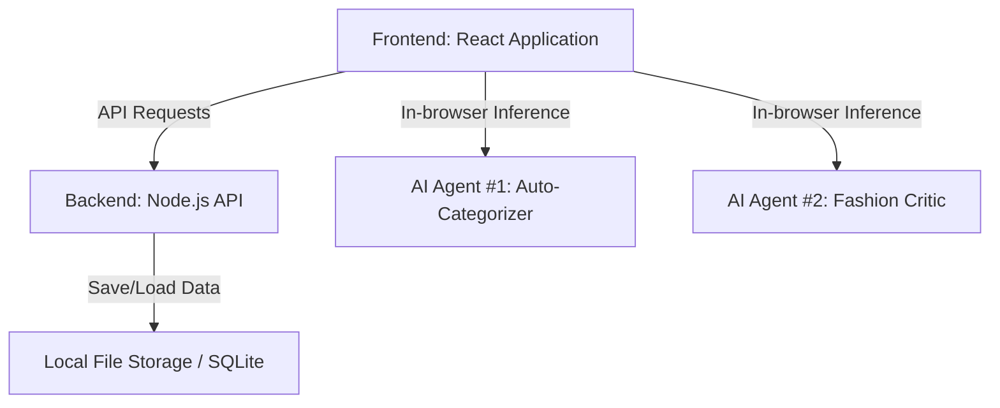
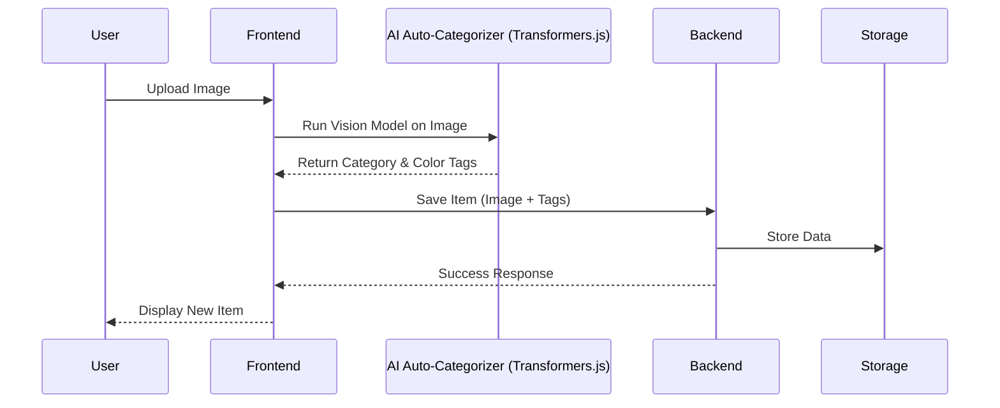
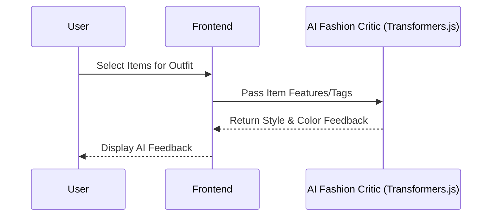

# System Architecture

## Component Diagram

```mermaid
graph TD
    UI[Frontend: React Application]
    API[Backend: Node.js API]
    Storage[Local File Storage / SQLite]
    AI1[AI Agent #1: Auto-Categorizer]
    AI2[AI Agent #2: Fashion Critic]

    UI -->|API Requests| API
    UI -->|In-browser Inference| AI1
    UI -->|In-browser Inference| AI2
    
    API -->|Save/Load Data| Storage
```

## Workflow: Adding a Garment

```mermaid
sequenceDiagram
    participant User
    participant Frontend
    participant Agent1 as AI Auto-Categorizer (Transformers.js)
    participant Backend
    participant Storage

    User->>Frontend: Upload Image
    Frontend->>Agent1: Run Vision Model on Image
    Agent1-->>Frontend: Return Category & Color Tags
    Frontend->>Backend: Save Item (Image + Tags)
    Backend->>Storage: Store Data
    Backend-->>Frontend: Success Response
    Frontend-->>User: Display New Item
```

## Workflow: Outfit Evaluation

```mermaid
sequenceDiagram
    participant User
    participant Frontend
    participant Agent2 as AI Fashion Critic (Transformers.js)

    User->>Frontend: Select Items for Outfit
    Frontend->>Agent2: Pass Item Features/Tags
    Agent2-->>Frontend: Return Style & Color Feedback
    Frontend-->>User: Display AI Feedback
```
