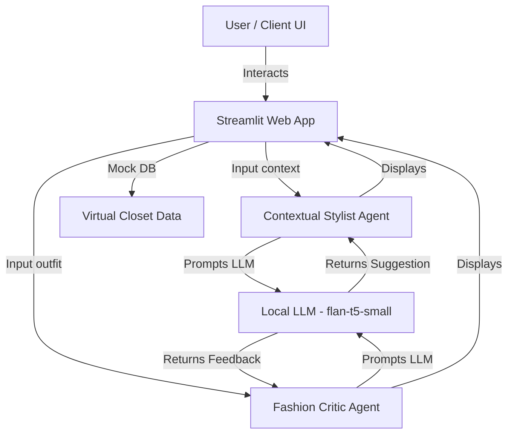
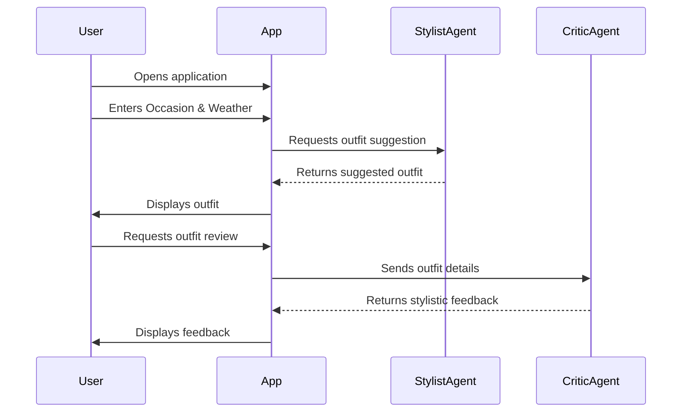

# OutfitCheck-AI Architecture & Workflow Diagrams

## Component Architecture

```mermaid
graph TD;
    User[User / Client UI] -->|Interacts| Streamlit[Streamlit Web App]
    Streamlit -->|Input context| Agent1[Contextual Stylist Agent]
    Streamlit -->|Input outfit| Agent2[Fashion Critic Agent]
    Agent1 -->|Prompts LLM| LocalLLM[Local LLM - flan-t5-small]
    Agent2 -->|Prompts LLM| LocalLLM
    LocalLLM -->|Returns Suggestion| Agent1
    LocalLLM -->|Returns Feedback| Agent2
    Agent1 -->|Displays| Streamlit
    Agent2 -->|Displays| Streamlit
    Streamlit -->|Mock DB| Closet[Virtual Closet Data]
```

## User Workflow

```mermaid
sequenceDiagram
    participant User
    participant App
    participant StylistAgent
    participant CriticAgent

    User->>App: Opens application
    User->>App: Enters Occasion & Weather
    App->>StylistAgent: Requests outfit suggestion
    StylistAgent-->>App: Returns suggested outfit
    App->>User: Displays outfit
    User->>App: Requests outfit review
    App->>CriticAgent: Sends outfit details
    CriticAgent-->>App: Returns stylistic feedback
    App->>User: Displays feedback
```
