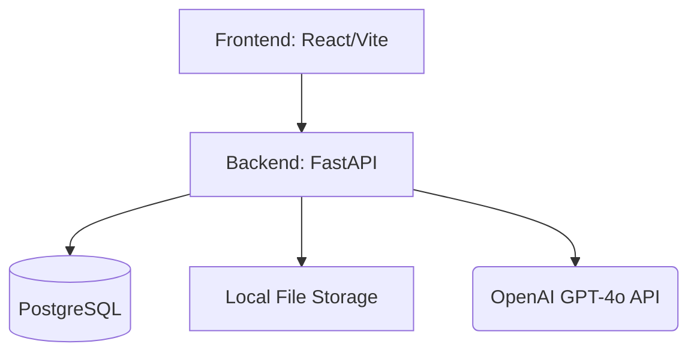
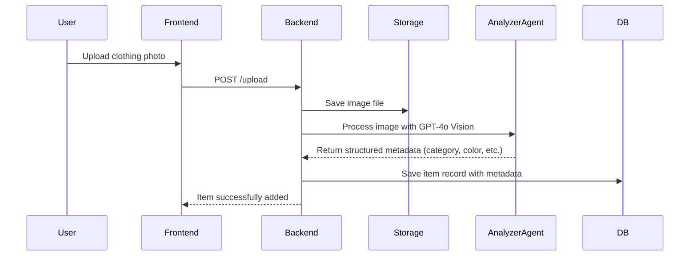
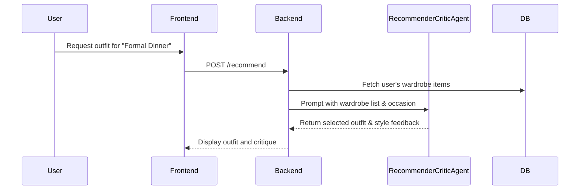

# Diagrams

*(Note: These Mermaid diagrams will be updated as the system implementation progresses.)*

## System Architecture

## AI Agent Flow (Upload)

## AI Agent Flow (Recommendation & Critique)

